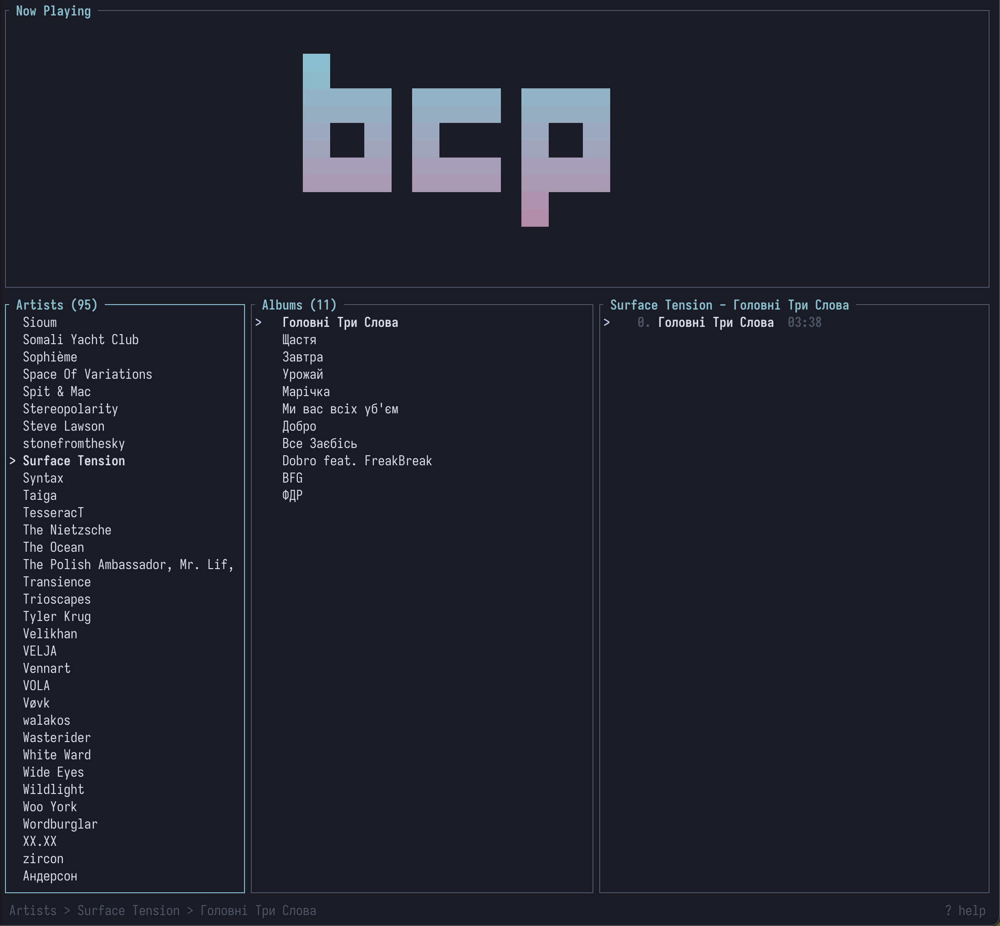
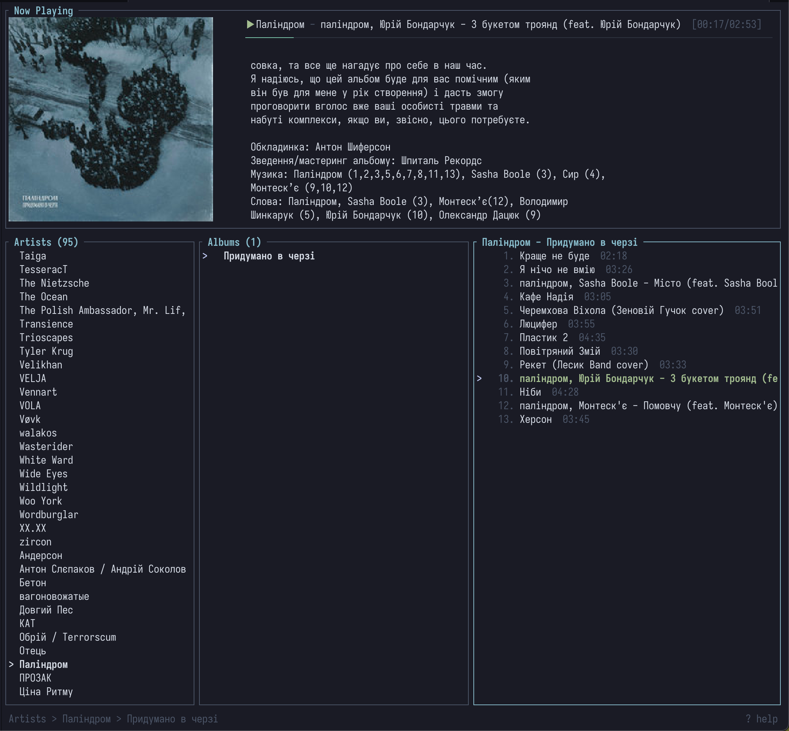
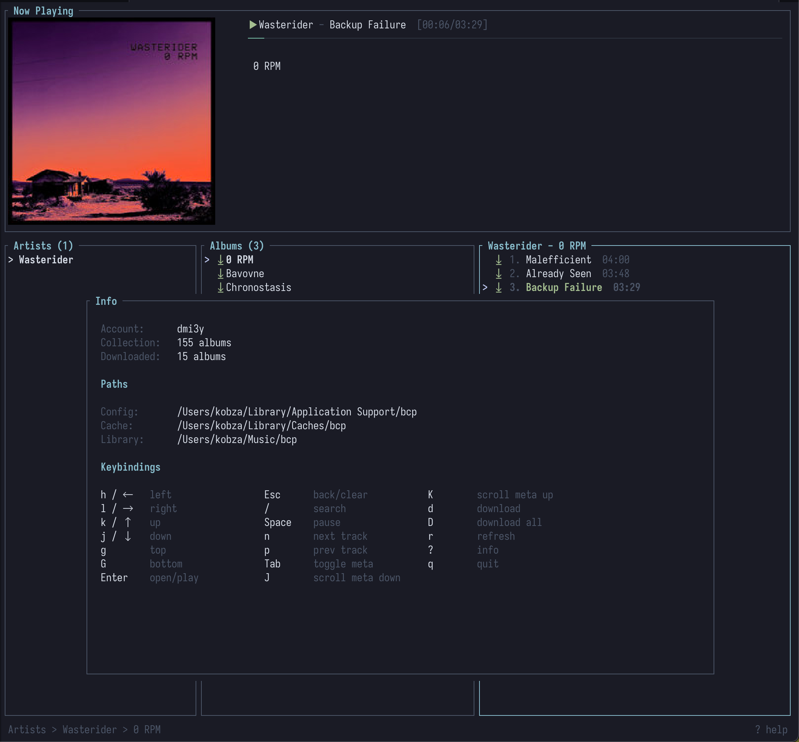

# bcp

`bcp` is a terminal client for [Bandcamp](https://bandcamp.com) that I always wanted to have because I spend most of my time in a terminal.
It has everything I need at the moment, including authentication via browser, search, local cache for downloaded tracks, covers and descriptions from album pages, and likely some bugs.
I made it with Claude, but read every single line of code it produced.

## Features

- Browse your Bandcamp collection by artist, album, and track
- Stream tracks directly from Bandcamp
- Download purchased music in FLAC, MP3 320, or MP3 V0
- Play downloaded tracks locally without streaming
- Search and filter your collection items
- Queue management with append and play-next
- Album art display on terminals with terminal image protocols
- Info panel with album metadata, credits, and release dates
- Mouse support for clicking and scrolling between panes
- Session persistence - remembers your selections and queue position

## Usage

```
cargo run
```

## Authentication

`bcp` needs your Bandcamp identity cookie to access your collection.

```
bcp login          # opens browser, auto-extracts cookie
bcp login --cookie <value>  # manual cookie input
bcp logout         # clears stored credentials
```

Auto-extraction works with Firefox, Chrome, Brave, Edge, Vivaldi, Opera, Zen, LibreWolf, and Waterfox.

## Configuration

Settings are stored in `~/.config/bcp/config.toml`:

```toml
[library]
path = "~/Music/bcp"   # download location (default)
format = "flac"         # download format: flac, mp3-320, mp3-v0
```

## Screenshots





