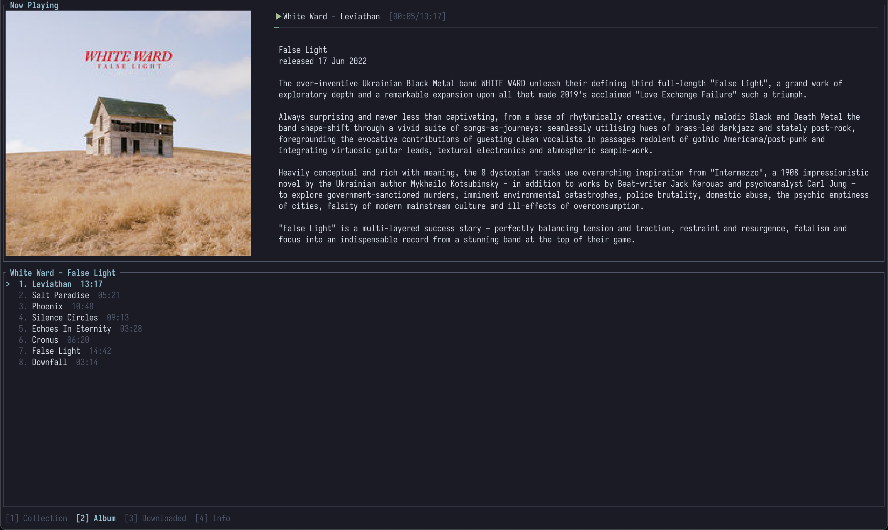

# bcp

`bcp` is a terminal client for [Bandcamp](https://bandcamp.com) that I always wanted to have because I spend most of my time living in a terminal. It has everything I need at the moment, including authentication via browser, search, local cache for downloaded tracks, covers and descriptions from album pages, and likely some bugs. I made it with Claude, but read every single line of code it produced.



## Usage

```
cargo run
```
